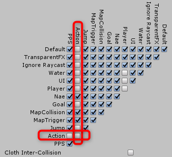

# 苗の持ち運び
苗は、アクションキーで運ぶことができる。

## 処理の流れ
- 立っている状態で、アクションキーを押して、最寄りが苗だった時に持ち運び状態に遷移
- アクションキーをもう一度押すか、水キーを押すと、苗を足元に置く
- 苗を置く場所は、0.25か0.5単位で調整
- すでに何か置いてある場所には置けない
- 段差のあるところには置かない
- 高い段差の手前の場合は足元に植える
- 苗を持っている状態ではジャンプできない
- 苗を持っている状態では、ツタの昇り降りはできない
- 苗を持っている状態で水に落ちると、苗を取り落として苗は落下

## アクションキー
アクションキーは状況に応じで行動が変化する。ステラの前方の一定の範囲を探索して、見つけた行動オブジェクトのうち、もっともステラに近いものについて行動を起こす。まずは探索する範囲を調べる処理を実装する。

### アクションキーの仕様
現在有効なオブジェクトは、将来的に光らせたりエッジを描画するなどして分かるようにしたいので、常時選択しておくようにしたい。そのため、ActionBoxにスクリプトを設定して、OnTrigger????で、常に接触しているオブジェクトを見つけるようにする。

- ステラから一定の相対座標の場所を常に監視して、行動が可能なオブジェクトをリストアップし、そのうちの最寄りのものを見つけておく
- 行動できる相手のオブジェクトには、Actableクラスを継承したクラスを作成してアタッチする。このクラスは`CanAction`プロパティーと`Action()`メソッドを実装する
- 行動範囲にあるオブジェクトがActableクラスを持ち、かつ、CanActionがtrueの場合、行動候補にリストアップする
- アクションキーが押されたら、検出済みの最寄りのオブジェクトのAction()メソッドを呼び出すことで、行動を開始する。どのような行動をするかは、Actable.Action()が管理するので、ステラのアクションキーの処理はここまでで終わり


### 探索範囲トリガーの作成
- Hierarchyウィンドウで空のゲームオブジェクトを作成して、`ActionBox`という名前にしておく
- ActionBoxに*BoxCollider*をアタッチする
- ActionBoxのTransformのPositionは0,0,0としておいて、位置と大きさはBoxColliderのCenterとSizeで調整して、行動相手を検出したい範囲をコライダーが示すようにする


- 調整ができたら、ProjectウィンドウからStellaプレハブをHierarchyにドラッグ＆ドロップして開く
- Hierarchyウィンドウにおいて、ActionBoxをドラッグして、Stellaにドロップして子供にする
- Inspectorウィンドウで、ActionBoxに以下の設定をする
  - TagとLayerにActionを追加して、どちらもActionにする
  - Is Triggerにチェック
- 変更を反映させるために、StellaのOverridesからApply Allをクリックしてすべて適用

以上が完了したら、HierarchyウィンドウからStellaオブジェクトを削除する。

### 接触の設定
不要なオブジェクトが反応しないようにレイヤーを設定する。Actionが検出したいのは、*Nae*, *MapCollision*, *MapTrigger*の3種類のレイヤーのみなので、Physics設定でそのように設定する。




### スクリプト実装
検出したアクションオブジェクトを管理するためのActableクラスを作成する。

```cs
using UnityEngine;

namespace GreeningEx2019
{
    /// <summary>
    /// アクションキーで動作する対象のオブジェクトは、このクラスを継承して実装します。
    /// </summary>
    public abstract class Actable : MonoBehaviour
    {
        /// <summary>
        /// 行動可能な時、trueを返します。
        /// </summary>
        public bool CanAction { get; protected set; }

        /// <summary>
        /// 行動を実行します。
        /// </summary>
        public abstract void Action();

        /// <summary>
        /// 選択された時に呼び出します。
        /// </summary>
        public virtual void Select() { }

        /// <summary>
        /// 選択を解除します。
        /// </summary>
        public virtual void Deselect() { }
    }
}
```

ActionBoxスクリプトを新規に作成して、ActionBoxオブジェクトにアタッチしてコードを作成する。実装するのは以下のような項目。

- ActionBoxに触れているアクション可能なオブジェクトのインスタンスを保持する配列
- トリガー判定によるインスタンスの記録
- トリガー外に出た時に、アクション可能なオブジェクトをリストから解除する
- 最寄りのオブジェクトを返す処理

### 方向転換で、ActionBoxの位置を変更
ステラは角度が真横ではなく少し手前に向いているので、ActionBoxを同じように動かすと、角度がズレてしまい管理が面倒になる。そこで、ActionBoxはステラのルートの子にはしつつ、左右の相対座標はスクリプトで制御するようにする。

左右方向はStellaMove.forwardVectorで取得できるので、ActionBoxスクリプトにこの値を参照して、左右の位置を調整するコードを追加する。

- `float offsetX;`を定義
- Startメソッド内で、`offsetX = Mathf.Abs(transform.localPosition.x);`で、ローカルX座標を記録しておく
- 以下のメソッドを定義

```cs
        public void UpdateSide()
        {
            Vector3 pos = transform.localPosition;
            pos.x = offsetX * StellaMove.forwardVector.x;
            transform.localPosition = pos;
        }
```

- SltellaWalkスクリプト内のWalk()メソッドにあるforwardVectorを設定した後に、上記のUpdateSide()を呼び出すコードを追加

## 苗用のアクションを作成する
アクションを呼び出す処理ができたら、苗のアクションを作成してアタッチする。まずは単純に呼び出しが成功しているかを確認するだけのものを用意する。

- `NaeActable`スクリプトを新規に作成して、Actableを継承させる
- 持ち運びが可能な苗のプレハブに、NaeActableをアタッチする
- 以下のようなコードを実装する

```cs
using System.Collections;
using System.Collections.Generic;
using UnityEngine;

namespace GreeningEx2019
{
    public class NaeActable : Actable
    {
        private void Awake()
        {
            CanAction = true;
        }

        public override void Action()
        {
            Debug.Log("Action");
        }
    }
}
```

- スクリプトができたら、苗のプレハブに作成したNaeActableスクリプトをアタッチする

以上でPlayして、苗の列挙や、アクションボタンを押した時にActionが呼び出されるかを確認する。
